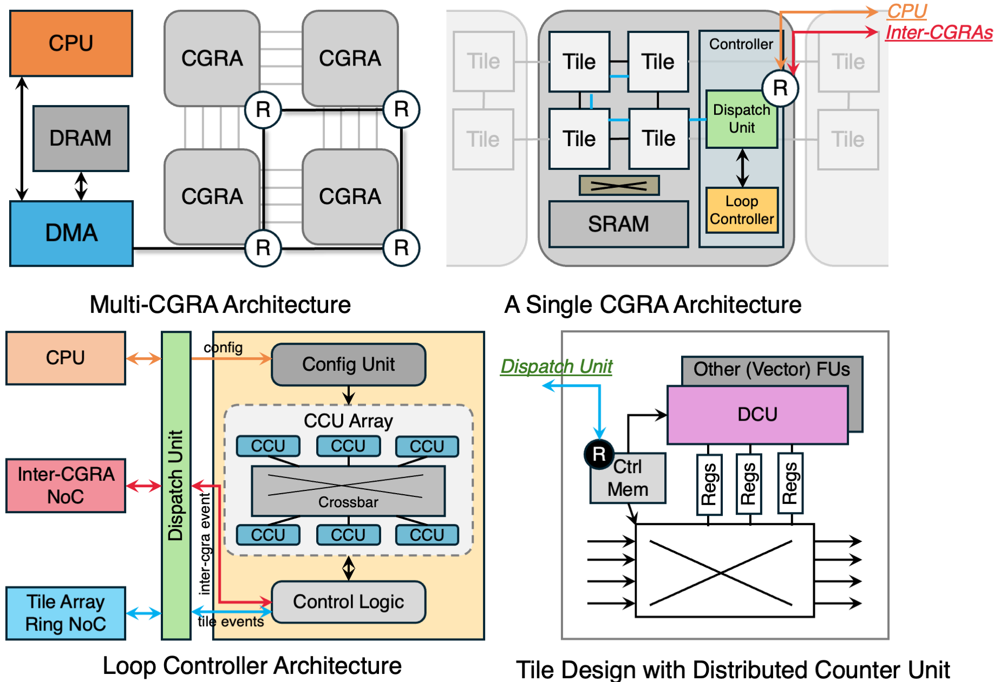

# Loop Controller (LC) Architecture

## Overview

The Loop Controller (LC) is a hardware module inside the CGRA Controller that manages **outer loop counters**. It works alongside the existing LoopCounter FU (DCU) on the tile array, which handles the innermost loop counting.




## Where LC Sits in the Architecture

```
  CPU
   │ CMD_LC_CONFIG_* (via NoC → Controller)
   ▼
┌──────────────────────────────────────────────────┐
│                     CGRA                         │
│                                                  │
│  ┌──────────────────┐    ┌────────────────────┐  │
│  │   Controller     │    │    Tile Array       │  │
│  │  ┌────────────┐  │    │  ┌──────┐ ┌──────┐ │  │
│  │  │  Crossbar  │  │    │  │Tile 0│ │Tile 1│ │  │
│  │  └────────────┘  │    │  │(DCU) │ │(DCU) │ │  │
│  │  ┌────────────┐  │    │  │Count │ │Deliv.│ │  │
│  │  │GlobalReduce│  │    │  └──────┘ └──────┘ │  │
│  │  └────────────┘  │    │  ┌──────┐ ┌──────┐ │  │
│  │  ┌────────────┐  │    │  │Tile 2│ │Tile 3│ │  │
│  │  │    Loop    │◄─┼────┼──│(FU)  │ │(FU)  │ │  │
│  │  │ Controller │──┼────┼─►│      │ │      │ │  │
│  │  │   (LC)     │  │    │  └──────┘ └──────┘ │  │
│  │  └────────────┘  │    └────────────────────┘  │
│  └──────────────────┘                            │
│         ▲  │                                     │
│         │  │  send_to_remote / recv_from_remote   │
└─────────┼──┼─────────────────────────────────────┘
          │  │
          │  ▼
    ┌─────────────┐
    │  Other CGRA │
    │  (with LC)  │
    └─────────────┘
```

## Command Flow

### 1. Configuration (CPU → Controller → LC)

The CPU sends config commands via the NoC. The Controller routes them to the LC.

| Command | Description | Sender → Receiver |
|---------|-------------|-------------------|
| `CMD_LC_CONFIG_LOWER` | Set loop lower bound | CPU → Controller → LC |
| `CMD_LC_CONFIG_UPPER` | Set loop upper bound | CPU → Controller → LC |
| `CMD_LC_CONFIG_STEP` | Set loop step | CPU → Controller → LC |
| `CMD_LC_CONFIG_CHILD_COUNT` | Set required child completions | CPU → Controller → LC |
| `CMD_LC_CONFIG_TARGET` | Register a target DCU | CPU → Controller → LC |
| `CMD_LC_CONFIG_PARENT` | Set parent CCU relationship | CPU → Controller → LC |
| `CMD_LC_LAUNCH` | Start all configured CCUs | CPU → Controller → LC |

### 2. Dispatch (LC → Tile Array DCUs)

When a CCU advances its loop variable, it dispatches commands to its target DCUs (1 command per target per cycle):

| Command | Target Type | Description | Sender → Receiver |
|---------|------------|-------------|-------------------|
| `CMD_RESET_LEAF_COUNTER` | Leaf DCU (`OPT_LOOP_COUNT`) | Reset inner loop counter to start next iteration | LC → DCU (tile) |
| `CMD_UPDATE_COUNTER_SHADOW_VALUE` | Delivery DCU (`OPT_LOOP_DELIVERY`) | Update shadow register with outer loop variable | LC → DCU (tile) |

### 3. Completion (DCU → LC)

When a leaf DCU finishes its inner loop, it sends a completion signal back to the LC:

| Command | Description | Sender → Receiver |
|---------|-------------|-------------------|
| `CMD_LEAF_COUNTER_COMPLETE` | Inner loop finished | DCU (tile) → LC |

### 4. Cross-CGRA Communication (LC ↔ LC)

For multi-CGRA loop nesting, LCs communicate via the inter-CGRA NoC:

| Command | Description | Sender → Receiver |
|---------|-------------|-------------------|
| `CMD_RESET_LEAF_COUNTER` | Reset remote DCU | LC (CGRA-0) → NoC → DCU (CGRA-1) |
| `CMD_UPDATE_COUNTER_SHADOW_VALUE` | Update remote shadow | LC (CGRA-0) → NoC → DCU (CGRA-1) |
| `CMD_LC_CHILD_COMPLETE` | Remote loop finished | LC (CGRA-1) → NoC → LC (CGRA-0) |

## Internal Structure: CCU DAG

```
Example: for(i) for(j) for(k) body(i,j,k)

  ┌──────────────┐
  │  CCU[0]      │  i = 0..N (root)
  │  child_cnt=1 │
  └──────┬───────┘
         │ internal completion
  ┌──────▼───────┐
  │  CCU[1]      │  j = 0..M (parent=CCU[0])
  │  child_cnt=1 │
  └──────┬───────┘
         │ targets
    ┌────┴────┐
    ▼         ▼
 ┌─────┐  ┌─────┐
 │DCU-A│  │DCU-B│
 │Count│  │Deliv│  (on tile array)
 │k=0.K│  │j val│
 └─────┘  └─────┘
```

- **CCU[0]** (root): Manages `i`. Target = delivery DCU for `i` value (shadow_only).
- **CCU[1]**: Manages `j`. Parent = CCU[0]. Targets = leaf DCU for `k` loop (reset) + delivery DCU for `j` value (shadow_only).
- When CCU[1] completes (j reaches bound), it **internally notifies** CCU[0] in the same cycle.
- When CCU[0] finishes dispatch, it **auto-resets** CCU[1] back to `j = lower_bound`.

## CCU State Machine

```
        CMD_LC_LAUNCH
  IDLE ──────────────→ RUNNING ◄────────────────┐
                          │                      │
                 child completions               │
                 count >= threshold              │
                          │                      │
                          ▼                      │
                    ┌──────────┐   all targets   │
   value >= upper   │DISPATCHING│──dispatched───→─┘
   ──────────→      └──────────┘
  COMPLETE            (1 cmd/cycle/target)
  (no dispatch)
```
